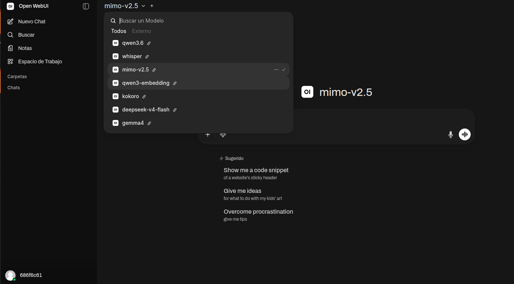

# NaN OpenWebUI

**Tu propio ChatGPT, con todos los modelos de NaN, corriendo en tu equipo y montado en 2 minutos.**

Una interfaz web tipo ChatGPT ([Open WebUI](https://github.com/open-webui/open-webui))
ya conectada a la API de [NaN](https://nan.builders). Self-hosted, en Docker, con tu
propia API key. Tus chats y tus cuentas se quedan en tu máquina.



> ¿No has usado Docker nunca? Sigue la **[guia paso a paso, a prueba de errores](GUIA-PASO-A-PASO.md)** y no te equivocaras. Si te atascas, hasta puedes pedirle a un asistente de IA (como OpenCode con un modelo de NaN, p. ej. `mimo-v2.5`) que te lo monte: le abres dentro de la carpeta y le dices "levanta esta imagen Docker siguiendo el README".

---

## Por qué NaN OpenWebUI

- **Un único frontend para todo NaN.** Chat, visión, audio y embeddings de todos los
  modelos de NaN desde la misma interfaz, sin saltar de herramienta.
- **Tus datos, tu casa.** Las conversaciones, usuarios y ajustes viven en tu Docker, no
  en la nube de un tercero. La API key es tuya y solo sale hacia NaN.
- **Coste predecible.** Pagas tu inferencia en NaN y punto: la interfaz es gratuita y
  open source, sin capas de suscripción por encima.
- **Listo para equipos.** Levanta un servidor para tu equipo o comunidad: cada persona
  con su cuenta, tú administras quién entra.
- **Sin lock-in.** Es compatible con la API de OpenAI; si mañana cambias de proveedor,
  cambias una URL.

> En una frase: la experiencia ChatGPT, con el catálogo de NaN, bajo tu control.

---

## Qué incluye

- **Open WebUI** (la UI self-hosted de referencia) preconfigurada para NaN.
- **Modelos de NaN** disponibles desde el selector:
  `qwen3.6`, `deepseek-v4-flash`, `mimo-v2.5`, `gemma4` (chat / visión / razonamiento),
  `whisper` (audio -> texto), `kokoro` (texto -> voz) y `qwen3-embedding` (embeddings).
- **Capacidades**: chat con historial, **visión** (subir imágenes a los modelos
  multimodales), **búsqueda web** (incluye SearXNG autoalojado, sin API key: el modelo
  busca en internet y responde con fuentes), **RAG** (subir documentos y preguntar),
  **audio** (transcripción y voz), multiusuario con control de acceso, y persistencia.
- **Despliegue en un comando** con Docker Compose.
- **API key segura por diseño**: solo vive en tu `.env`, nunca en la imagen ni en el repo.

---

## Requisitos

- [Docker](https://docs.docker.com/get-docker/) y Docker Compose.
- Una **API key de NaN** -> https://nan.builders

---

## Puesta en marcha

```bash
# 0) Descarga el proyecto desde GitHub
git clone https://github.com/686f6c61/NaN-Open-WebUI.git
cd NaN-Open-WebUI

# 1) Crea tu .env (genera tambien la clave secreta de sesion)
./setup.sh

# 2) Edita .env y pon tu API key en NAN_API_KEY
nano .env

# 3) Arranca
docker compose up -d
```

Abre **http://localhost:3000**. La **primera cuenta que crees sera la de administrador**.

> Windows/Mac sin `./setup.sh`: copia `.env.example` a `.env`, pon tu `NAN_API_KEY` y
> (recomendado) genera una `WEBUI_SECRET_KEY` con `openssl rand -hex 32`. Luego
> `docker compose up -d`.

---

## Usar solo la imagen, sin clonar

La imagen esta publicada en **GitHub Packages (GHCR)**, asi que puedes arrancarla con un
solo comando (cambia `sk-tu-key-de-nan` por tu clave):

```bash
docker run -d --name nan-open-webui -p 3000:8080 \
  -e ENABLE_OPENAI_API=true \
  -e OPENAI_API_BASE_URL=https://api.nan.builders/v1 \
  -e OPENAI_API_KEY=sk-tu-key-de-nan \
  -e WEBUI_AUTH=true \
  -v nan-open-webui-data:/app/backend/data \
  ghcr.io/686f6c61/nan-open-webui:latest
```

Imagen: `ghcr.io/686f6c61/nan-open-webui:latest`

> Nota: este modo de un solo contenedor **no incluye la búsqueda web** (que necesita el
> servicio SearXNG). Para tener búsqueda web, usa el `docker compose up -d` de arriba.

---

## Configuracion (`.env`)

| Variable | Obligatoria | Por defecto | Descripcion |
|---|---|---|---|
| `NAN_API_KEY` | **Si** | — | Tu API key de NaN |
| `WEBUI_SECRET_KEY` | Recomendado | (se genera) | Firma las sesiones de la web |
| `WEBUI_PORT` | No | `3000` | Puerto local de la interfaz |
| `WEBUI_NAME` | No | `NaN Chat` | Nombre mostrado en la UI |
| `ENABLE_SIGNUP` | No | `true` | Permitir nuevos registros |
| `OPENAI_API_BASE_URL` | No | `https://api.nan.builders/v1` | Endpoint OpenAI-compatible |

Tras crear tu cuenta admin, si no quieres mas registros pon `ENABLE_SIGNUP=false` y
`docker compose up -d`.

---

## Seguridad de la API key

- La key vive **solo en tu `.env` local**. No esta en la imagen Docker, ni en el
  `docker-compose.yml`, ni en el repositorio.
- El `.gitignore` excluye `.env`: **no lo subes a git por error**.
- Si arrancas sin key, Compose **se detiene con un aviso claro** en vez de arrancar mal.
- **No compartas tu `.env`.** Para pasarle esto a otra persona, dale el proyecto **sin el
  `.env`** (o solo el `.env.example`); que cada uno ponga la suya.
- Si tu key se filtra, **revocala/rotala** en NaN y actualiza el `.env`.

---

## Desplegarlo para tu comunidad

**Opcion A (recomendada): comparte la carpeta** sin tu `.env`. Cada persona hace
`./setup.sh`, pone su `NAN_API_KEY` y arranca.

**Opcion B: publica la imagen** preconfigurada (sin secretos dentro):

```bash
docker build -t TU_USUARIO/nan-open-webui:latest .
docker push   TU_USUARIO/nan-open-webui:latest
```

Quien la reciba solo necesita el `docker-compose.yml` + `.env.example` y su propia key.

---

## Comandos utiles

```bash
docker compose up -d                            # arrancar / aplicar cambios
docker compose logs -f                          # ver logs
docker compose down                             # parar (conserva los datos)
docker compose pull && docker compose up -d     # actualizar Open WebUI
docker compose down -v                          # parar y BORRAR todos los datos
```

Los datos (cuentas, chats, ajustes) persisten en el volumen `nan-open-webui-data`.

---

## Solucion de problemas

- **No aparece ningun modelo** -> la `NAN_API_KEY` es incorrecta o vacia. Verificala:
  `curl https://api.nan.builders/v1/models -H "Authorization: Bearer TU_KEY"`
- **El puerto 3000 esta ocupado** -> cambia `WEBUI_PORT` en `.env` y `docker compose up -d`.
- **"Falta NAN_API_KEY"** al arrancar -> ejecuta `./setup.sh` y rellena el `.env`.
- **Una imagen da "no soporta imagenes"** -> selecciona un modelo de **vision**
  (`qwen3.6`, `gemma4`, `mimo-v2.5`), no uno de solo texto como `deepseek-v4-flash`.

---

## Notas

- Por defecto la web escucha en `0.0.0.0:WEBUI_PORT`, accesible desde tu **red local**
  (`http://IP-de-tu-equipo:3000`). Exponerlo a internet requiere HTTPS + firewall, fuera
  del alcance de este paquete.
- Compatible con cualquier endpoint estilo OpenAI: cambia `OPENAI_API_BASE_URL` para usar
  otro proveedor.

---

*Hecho para la comunidad de NaN. Open WebUI es un proyecto open source independiente;
NaN es el proveedor de inferencia. Cada usuario aporta su propia API key.*
