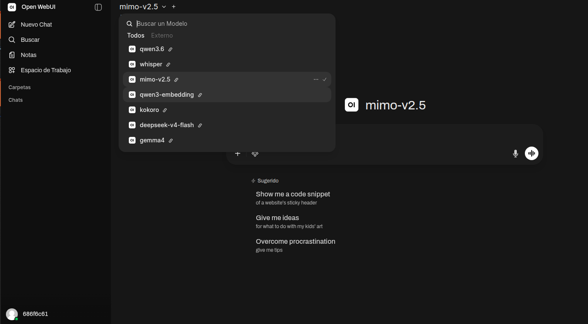

# NaN OpenWebUI

**Tu propio ChatGPT, con todos los modelos de NaN, corriendo en tu equipo y montado en 2 minutos.**

Version actual: **v0.0.9**. Cambios: [CHANGELOG.md](CHANGELOG.md).

Una interfaz web tipo ChatGPT ([Open WebUI](https://github.com/open-webui/open-webui))
ya conectada a la API de [NaN](https://nan.builders). Self-hosted, en Docker, con tu
propia API key. Tus chats y tus cuentas se quedan en tu máquina.



> ¿No has usado Docker nunca? Sigue la **[guia paso a paso, a prueba de errores](GUIA-PASO-A-PASO.md)** y no te equivocaras. Si te atascas, hasta puedes pedirle a un asistente de IA (como OpenCode con un modelo de NaN, p. ej. `mimo-v2.5`) que te lo monte: le abres dentro de la carpeta y le dices "levanta esta imagen Docker siguiendo el README".

---

## Por qué NaN OpenWebUI

- **Un único frontend para todo NaN.** Chat, visión, audio y embeddings de todos los
  modelos de NaN desde la misma interfaz, sin saltar de herramienta.
- **Tus datos, tu casa.** Las conversaciones, usuarios y ajustes viven en tu Docker, no
  en la nube de un tercero. La API key es tuya y solo sale hacia NaN.
- **Coste predecible.** Pagas tu inferencia en NaN y punto: la interfaz es gratuita y
  open source, sin capas de suscripción por encima.
- **Listo para equipos.** Levanta un servidor para tu equipo o comunidad: cada persona
  con su cuenta, tú administras quién entra (ver [Multiusuario](#multiusuario-varios-perfiles)).
- **Sin lock-in.** Es compatible con la API de OpenAI; si mañana cambias de proveedor,
  cambias una URL.

> En una frase: la experiencia ChatGPT, con el catálogo de NaN, bajo tu control.

---

## Qué incluye

- **Open WebUI** (la UI self-hosted de referencia) preconfigurada para NaN, publicada
  como imagen Docker lista para usar (`ghcr.io/686f6c61/nan-open-webui`, sin ningún
  secreto dentro).
- **Modelos de NaN** disponibles desde el selector:
  `qwen3.6`, `deepseek-v4-flash`, `mimo-v2.5`, `gemma4` (chat / visión / razonamiento /
  coding), `whisper` (audio -> texto), `kokoro` (texto -> voz),
  `qwen3-embedding` (embeddings) y `flux-2-klein` (generación / edición de imágenes).
- **Capacidades**: chat con historial, **visión** (subir imágenes a los modelos
  multimodales), **búsqueda web** (incluye SearXNG autoalojado, sin API key: el modelo
  busca en internet y responde con fuentes), **voz** (lee las respuestas con `kokoro` de
  NaN y dicta con un whisper local), **intérprete de código** (el modelo escribe y ejecuta
  Python en el navegador), **RAG** sobre tus documentos (embeddings con `qwen3-embedding`),
  **generación y edición de imágenes** con `flux-2-klein`, multiusuario con control de
  acceso, y persistencia.
- **Despliegue en un comando** con Docker Compose.
- **API key segura por diseño**: solo vive en tu `.env`, nunca en la imagen ni en el repo.

---

## Requisitos

- [Docker](https://docs.docker.com/get-docker/) y Docker Compose.
- Una **API key de NaN** -> https://nan.builders

---

## Puesta en marcha

```bash
# 0) Descarga el proyecto desde GitHub
git clone https://github.com/686f6c61/NaN-Open-WebUI.git
cd NaN-Open-WebUI

# 1) Crea tu .env (genera tambien los secretos locales)
./setup.sh

# 2) Edita .env y pon tu API key en NAN_API_KEY
nano .env

# 3) Arranca
docker compose up -d
```

Abre **http://localhost:3000**. La **primera cuenta que crees sera la de administrador**.

> Windows/Mac sin `./setup.sh`: copia `.env.example` a `.env`, pon tu `NAN_API_KEY` y
> genera `WEBUI_SECRET_KEY` y `SEARXNG_SECRET` con `openssl rand -hex 32`. Luego
> `docker compose up -d`.

---

## Usar solo la imagen, sin clonar

La imagen publicada en GHCR ya trae la preconfiguración de NaN (modelos, imágenes,
voz, RAG apuntando a `https://api.nan.builders/v1`), así que solo necesitas inyectar
tu key y los secretos en runtime:

```bash
docker run -d --name nan-open-webui -p 127.0.0.1:3000:8080 \
  -e OPENAI_API_KEY=sk-tu-key-de-nan \
  -e WEBUI_SECRET_KEY=$(openssl rand -hex 32) \
  -e ENABLE_WEB_SEARCH=false \
  -v nan-open-webui-data:/app/backend/data \
  ghcr.io/686f6c61/nan-open-webui:v0.0.9
```

Imagen: `ghcr.io/686f6c61/nan-open-webui` (tags `vX.Y.Z` y `latest`).

> Nota: este modo de un solo contenedor **no incluye la búsqueda web** (que necesita el
> servicio SearXNG), por eso se desactiva. Para tener búsqueda web, usa el
> `docker compose up -d` de arriba.

---

## Multiusuario (varios perfiles)

Open WebUI es multiusuario con roles (admin / user / pending). El flujo recomendado
para un equipo o comunidad con este paquete:

1. **Tú creas la primera cuenta** (esa es la de administrador).
2. **Los demás se registran solos**: con `DEFAULT_USER_ROLE=pending` (por defecto), cada
   registro queda en espera hasta que tú lo apruebes desde
   *Panel de administración > Users*. Si prefieres que entren sin aprobación, pon
   `DEFAULT_USER_ROLE=user` en el `.env`.
3. **Cuando el censo esté cerrado**, pon `ENABLE_SIGNUP=false` en el `.env` y
   `docker compose up -d`.
4. **Modelos por grupo** (opcional): `BYPASS_MODEL_ACCESS_CONTROL=false` (por defecto)
   respeta el control de acceso; desde el panel puedes reservar modelos concretos a
   grupos concretos. Con `true`, todos ven todos los modelos siempre.

> Importante: con una única `NAN_API_KEY` compartida, el consumo de **todos** los
> usuarios (chat, imágenes, voz) sale de **tu** cuenta de NaN: cuota y facturación son
> agregadas y no se puede atribuir por persona. Para una comunidad grande valora que
> cada usuario ponga su propia key en *Ajustes > Conexiones* (el admin debe
> permitirlo), quedando la tuya solo como conexión por defecto.

Para exponerlo en internet con HTTPS, backups y actualizaciones controladas, sigue
**[PRODUCCION.md](PRODUCCION.md)**.

---

## Configuracion (`.env`)

| Variable | Obligatoria | Por defecto | Descripcion |
|---|---|---|---|
| `NAN_API_KEY` | **Si** | — | Tu API key de NaN |
| `WEBUI_SECRET_KEY` | Recomendado | (se genera) | Firma las sesiones de la web |
| `SEARXNG_SECRET` | **Si** | (se genera) | Secreto local de SearXNG para la busqueda web |
| `OPENWEBUI_IMAGE` | No | `ghcr.io/686f6c61/nan-open-webui:v0.0.9` | Imagen y tag a usar; sube el tag para actualizar |
| `WEBUI_BIND` | No | `127.0.0.1` | Interfaz donde se publica; `0.0.0.0` para red local |
| `WEBUI_PORT` | No | `3000` | Puerto local de la interfaz |
| `WEBUI_NAME` | No | `NaN Chat` | Nombre mostrado en la UI |
| `ENABLE_SIGNUP` | No | `true` | Permitir nuevos registros (ponlo `false` al cerrar el censo) |
| `DEFAULT_USER_ROLE` | No | `pending` | Rol de los registros nuevos: `pending` (aprobación) o `user` |
| `BYPASS_MODEL_ACCESS_CONTROL` | No | `false` | `false` respeta el control de modelos por grupo |
| `ENABLE_PERSISTENT_CONFIG` | No | `true` | Ver [Configuracion persistente](#configuracion-persistente-importante) |
| `WEBUI_URL` | No | — | URL pública (producción con dominio) |
| `CORS_ALLOW_ORIGIN` | No | `*` | Orígenes CORS permitidos, `;` para separar |
| `OPENAI_API_BASE_URL` | No | `https://api.nan.builders/v1` | Endpoint OpenAI-compatible |
| `OPENAI_API_CONFIGS` | No | (en `.env.example`) | Modelos de chat visibles en el selector |
| `DEFAULT_MODEL_PARAMS` | No | `{"function_calling":"legacy"}` | Fuerza herramientas legacy para que **Image** funcione con modelos sin tool calling nativo declarado |
| `ENABLE_IMAGE_GENERATION` | No | `true` | Activar generación de imágenes |
| `ENABLE_IMAGE_PROMPT_GENERATION` | No | `false` | Evita reescribir el prompt con el modelo de chat antes de llamar a `flux-2-klein` |
| `ENABLE_IMAGE_EDIT` | No | `true` | Activar edición / image-to-image |
| `IMAGE_GENERATION_MODEL` | No | `flux-2-klein` | Modelo de imágenes de NaN |
| `IMAGE_SIZE` | No | `1024x1024` | Tamaño por defecto; múltiplos de 16, 256-1536 px y ratio 1:3-3:1 |
| `IMAGES_OPENAI_PARAMS` | No | — | JSON opcional para generación, por ejemplo `{"seed":42,"guidance":3.5}` |

Tras crear tu cuenta admin, si no quieres mas registros pon `ENABLE_SIGNUP=false` y
`docker compose up -d`.

### Configuracion persistente (importante)

Open WebUI guarda su configuración en su base de datos interna: **lo que cambies en el
panel de administración manda sobre el `.env`** en los siguientes reinicios. Esto
afecta a cosas como la API key de las conexiones, los modelos visibles o el registro.

- Para cambiar la API key después del primer arranque: hazlo en el panel
  (*Admin > Settings > Connections*) y, para mantener el `.env` sincronizado,
  también en `NAN_API_KEY` (así un despliegue desde cero queda idéntico).
- Si prefieres que el `.env` sea siempre la fuente de verdad (útil en despliegues
  gestionados), pon `ENABLE_PERSISTENT_CONFIG=false`: los cambios hechos en el panel
  se perderán al reiniciar.

---

## Seguridad de la API key

- La key vive **solo en tu `.env` local**. No esta en la imagen Docker, ni en el
  `docker-compose.yml`, ni en el repositorio.
- La imagen publicada en GHCR es pública y **no contiene ningún secreto**: solo
  valores no sensibles (URLs de NaN, nombres de modelo, interruptores).
- Los secretos internos (`WEBUI_SECRET_KEY` y `SEARXNG_SECRET`) tambien se generan en
  `.env`; el repo no comparte valores reales entre instalaciones.
- El `.gitignore` y el `.dockerignore` excluyen `.env`: **no lo subes a git por error**
  ni entra en el contexto de build.
- Si arrancas sin key, Compose **se detiene con un aviso claro** en vez de arrancar mal.
- Por defecto la web solo escucha en `127.0.0.1` (tu equipo). Con `WEBUI_BIND=0.0.0.0`
  la compartes en tu red local, bajo tu responsabilidad.
- **No compartas tu `.env`.** Para pasarle esto a otra persona, dale el proyecto **sin el
  `.env`** (o solo el `.env.example`); que cada uno ponga la suya.
- Si tu key se filtra, **revocala/rotala** en NaN, actualiza el `.env` **y** el panel de
  administración (ver [Configuracion persistente](#configuracion-persistente-importante)).

---

## Comandos utiles

```bash
docker compose up -d                            # arrancar / aplicar cambios del .env
docker compose logs -f                          # ver logs
docker compose down                             # parar (conserva los datos)
docker compose pull && docker compose up -d     # actualizar (SearXNG; ver nota)
```

> La imagen de Open WebUI va **fijada por tag** (`OPENWEBUI_IMAGE`): actualizar es una
> decision deliberada. Para subir de version: cambia el tag en el `.env` (p. ej. a
> `v0.0.9`), haz un [backup](PRODUCCION.md#backups) si tienes datos importantes, y
> `docker compose up -d`. SearXNG sí se actualiza solo (`latest`): es un servicio sin
  estado que no guarda tus datos.
Los datos (cuentas, chats, ajustes) persisten en el volumen `nan-open-webui-data`.

### Generar imagenes en Open WebUI

En un chat, pulsa el boton **Integrations** junto a la caja de texto y activa **Image**
(icono de foto). Escribe el prompt y envia. No selecciones `flux-2-klein` en el selector
superior de modelos: el selector superior es para chat; la integracion **Image** usa
`flux-2-klein` por debajo. Que arriba siga seleccionado `qwen3.6` es normal.

---

## Solucion de problemas

- **No aparece ningun modelo** -> la `NAN_API_KEY` es incorrecta o vacia. Verificala:
  `curl https://api.nan.builders/v1/models -H "Authorization: Bearer TU_KEY"`
- **El puerto 3000 esta ocupado** -> cambia `WEBUI_PORT` en `.env` y `docker compose up -d`.
- **"Falta NAN_API_KEY"** al arrancar -> ejecuta `./setup.sh` y rellena el `.env`.
- **Una imagen da "no soporta imagenes"** -> selecciona un modelo de **vision**
  (`qwen3.6`, `gemma4`, `mimo-v2.5`), no uno de solo texto como `deepseek-v4-flash`.
- **Pides una foto y responde texto / no adjunta imagen** -> no esta activa la
  integracion **Image** o el chat esta en tool calling nativo. Activa **Integrations >
  Image** y deja `DEFAULT_MODEL_PARAMS={"function_calling":"legacy"}`.
- **No puedo entrar desde otro equipo de mi red** -> por defecto la web solo escucha en
  `127.0.0.1`. Pon `WEBUI_BIND=0.0.0.0` en el `.env` para compartirla en tu red local.
- **Generar/editar imagenes falla** -> comprueba que tu cuenta de NaN tiene membresia
  `inference-tier`, que no has agotado la cuota de `flux-2-klein` (100 requests/mes),
  que no estas disparando mas de 1 request/s, y que `IMAGE_SIZE` usa valores soportados
  (256-1536 px, múltiplos de 16 y ratio 1:3-3:1).
- **`docker compose up` se queda esperando a SearXNG** -> el contenedor `nan-searxng`
  debe quedar `healthy`; revisa `docker compose logs searxng`.

---

## Notas

- Por defecto la web escucha en `127.0.0.1:WEBUI_PORT`, solo accesible desde tu equipo.
  Para tu red local: `WEBUI_BIND=0.0.0.0`. Para internet: proxy inverso con HTTPS, ver
  **[PRODUCCION.md](PRODUCCION.md)**.
- Compatible con cualquier endpoint estilo OpenAI: cambia `OPENAI_API_BASE_URL` para usar
  otro proveedor.

---

*Hecho para la comunidad de NaN. Open WebUI es un proyecto open source independiente;
NaN es el proveedor de inferencia. Cada usuario aporta su propia API key.*
